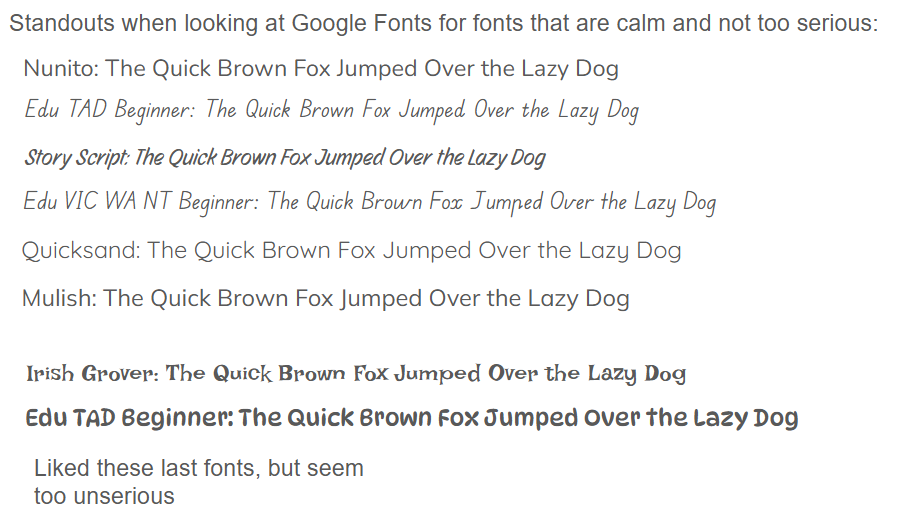
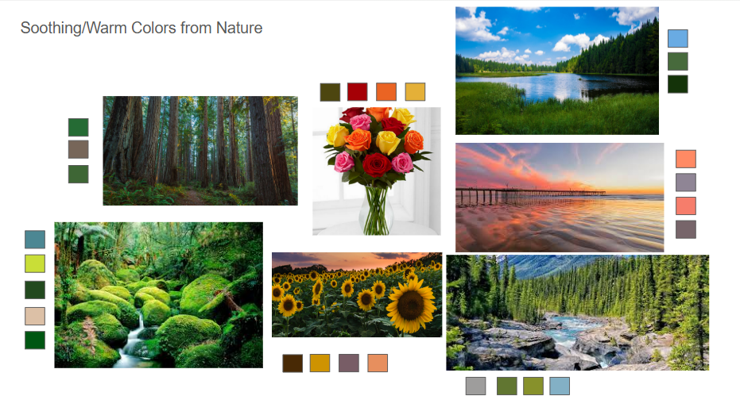

# Frontend UI Coding

## User Journey:
A user just started their academic career at a University. They are overwhelmed by work in each class they are taking and want to consolidate all the information to plan out their schedule better. They would sign up and log in to BrontoBoard. Initially, they would see an empty board with a big button to create a class. Being sent to a new page to input information for the class, they would then do the same for each class.

Once the user has set up all the classes, they could either click a new button that's popped up,"Add Assignment", or click on a class to enter the AnkyloView of the class. If they press the immediate button, they would add the most recent assignments that are due for each class. Then, entering a class's AnkyloView would allow them to view all the relevant information of the class, such as its overview, important notes, and all the assignments due dates.

Additionally, if the user would want a different pespective of their work, they could use the CalenderSaurus. They would see the current week and all due dates on their corresponding days for that week. Or if they want a better view, they could switch to view all due dates for the current month. 

## Visual Design Study

Highlights the main fonts that I was interested in. I was looking for fonts with a more gentle feel but not too unserious.

Looked more towards nature for inspiration of color. These were the main ones I liked and drew inspiration from in the major colors.

## [Updated Screen Recording](./assets/61040-4b-updated-rec.mp4)  
The screen recording has audio, but I was unable to find a way to have it play in the markdown file. It would need to be downloaded first.
